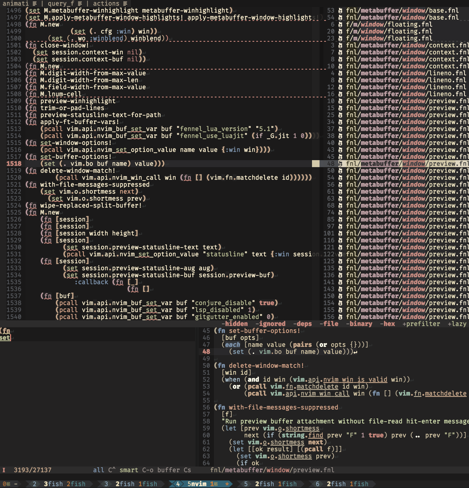

# metabuffer

Interactive buffer/project line filtering for Neovim without leaving your current window, and allowing changes made to the filtered view (including over multiple files) to propagate back to origin. "The new argdo". But there are many more features planned, including for LLM workflows.
Mostly vibecoded enhanced port of my old Python remote plugin [metabuffer.nvim](https://github.com/tolgraven/metabuffer.nvim) which started as a fork of [lambdalisue/nvim-lista](https://github.com/lambdalisue/nvim-lista) where I got the in-window idea I then kept exploring the possibilities of.



The right-side info window now keeps a live winbar with visible-range/loading progress, and uses non-empty loading placeholders instead of flashing blank pages during project bootstrap, fast scroll refreshes, or source-mode switches like `#file`.

## User Guide

### Setup

Use normal Lua setup options (no `vim.g` required):

```lua
require("metabuffer").setup({
  options = {
    prompt_update_debounce_ms = 170,
    window_local_layout = true,
    project_lazy_enabled = true,
  },
  ui = {
    animation = {
      enabled = true,
      backend = "mini",
      time_scale = 1.0,
      loading_indicator = true,
      prompt = { enabled = true, time_scale = 1.0 },
      preview = { enabled = true, time_scale = 1.0 },
      info = { enabled = true, time_scale = 1.0 },
      loading = { enabled = true, time_scale = 1.0 },
      scroll = { enabled = true, time_scale = 1.0, backend = "mini" },
    },
  },
  keymaps = {
    prompt = {
      { { "n", "i" }, "<CR>", "accept" },
      { "n", "<Esc>", "cancel" },
      { "n", "<C-p>", "move-selection", -1 },
      { "n", "<C-n>", "move-selection", 1 },
      { "i", "<C-p>", "move-selection", -1 },
      { "i", "<C-n>", "move-selection", 1 },
      { "n", "<C-k>", "move-selection", -1 },
      { "n", "<C-j>", "move-selection", 1 },
      { "i", "<C-k>", "move-selection", -1 },
      { "i", "<C-j>", "move-selection", 1 },
      { "i", "<C-a>", "prompt-home" },
      { "i", "<C-e>", "prompt-end" },
      { "i", "<C-u>", "prompt-kill-backward" },
      { "i", "<C-y>", "prompt-yank" },
      { "i", "<S-CR>", "prompt-newline" },
      { "i", "<Up>", "history-or-move", 1 },
      { "i", "<Down>", "history-or-move", -1 },
      { "n", "<Up>", "history-or-move", 1 },
      { "n", "<Down>", "history-or-move", -1 },
      { "i", "!!", "insert-last-prompt" },
      { "n", "!!", "insert-last-prompt" },
      { "i", "!$", "insert-last-token" },
      { "n", "!$", "insert-last-token" },
      { "i", "!^!", "insert-last-tail" },
      { "n", "!^!", "insert-last-tail" },
      { "i", "<LocalLeader>1", "negate-current-token" },
      { "i", "<LocalLeader>!", "negate-current-token" },
      { "n", "<LocalLeader>h", "merge-history" },
      { "i", "<LocalLeader>h", "merge-history" },
      { "i", "<C-r>", "history-searchback" },
      { { "n", "i" }, "<C-^>", "switch-mode", "matcher" },
      { { "n", "i" }, "<C-6>", "switch-mode", "matcher" },
      { { "n", "i" }, "<C-_>", "switch-mode", "case" },
      { { "n", "i" }, "<C-/>", "switch-mode", "case" },
      { { "n", "i" }, "<C-?>", "switch-mode", "case" },
      { { "n", "i" }, "<C-->", "switch-mode", "case" },
      { { "n", "i" }, "<C-o>", "switch-mode", "case" },
      { { "n", "i" }, "<C-s>", "switch-mode", "syntax" },
      { "n", "<C-g>", "toggle-scan-option", "ignored" },
      { "n", "<C-l>", "toggle-scan-option", "deps" },
      { { "n", "i" }, "<C-d>", "scroll-main", "half-down" },
      { "n", "<C-u>", "scroll-main", "half-up" },
      { { "n", "i" }, "<C-f>", "scroll-main", "page-down" },
      { { "n", "i" }, "<C-b>", "scroll-main", "page-up" },
      { { "n", "i" }, "<C-t>", "toggle-project-mode" },
    },
    main = {
      { "n", "!", "exclude-symbol-under-cursor" },
      { "n", "<CR>", "accept-main" },
      { "n", "<M-CR>", "insert-symbol-under-cursor" },
      { "n", "<A-CR>", "insert-symbol-under-cursor" },
    },
    prompt_fallback = {
      { "i", "<C-a>", "prompt-home" },
      { "i", "<C-e>", "prompt-end" },
      { "i", "<C-u>", "prompt-kill-backward" },
      { "i", "<C-k>", "move-selection", -1 },
      { "i", "<C-y>", "prompt-yank" },
    },
  },
  ui = {
    prefix = "#",
    syntax_on_init = "buffer",
    highlight_groups = { All = "Title", Fuzzy = "Number", Regex = "Special" },
  },
})
```

Inspect defaults from Lua:

```lua
require("metabuffer").defaults
```

Animation controls:

- `ui.animation.enabled`: master on/off switch for Meta window animations
- `ui.animation.backend`: global animation backend, `"mini"` or `"native"`
- `ui.animation.time_scale`: master speed multiplier
  - `1.0` = normal
  - `0.5` = twice as fast
  - `2.0` = half speed
- Per-animation toggles and speed scales:
  - `ui.animation.prompt.enabled`, `ui.animation.prompt.time_scale`
  - `ui.animation.preview.enabled`, `ui.animation.preview.time_scale`
  - `ui.animation.info.enabled`, `ui.animation.info.time_scale`

Custom transforms:

- Define them under `options.custom.transforms`.
- Invoke them as `#transform:name`.
- Runtime short aliases are derived automatically from the directive registry; completion/help popup will show the current alias if you want a shorter form.

```lua
require("metabuffer").setup({
  options = {
    custom = {
      transforms = {
        upper = {
          from = { "tr", "a-z", "A-Z" },
          to = { "tr", "A-Z", "a-z" },
          scope = "line",
          applies_to = "text",
          doc = "Uppercase visible lines.",
        },
      },
    },
  },
})
```

- `from`: required shell command, either argv list or shell string, fed through stdin
- `to`: optional reverse command used on writeback
- `scope`: `"line"` or `"file"`; defaults to `"line"`
- `applies_to`: `"text"`, `"binary"`, or `"all"`; defaults to `"text"`
- `filetypes`: optional list of detected filetypes to limit where the transform applies
- `filetype_commands`: optional per-filetype command map overriding `from`/`to`
- `enabled`: optional default on/off state
- `doc`: help text used by completion/popup docs

Example decompile-style transform:

```lua
require("metabuffer").setup({
  options = {
    custom = {
      transforms = {
        decompyle = {
          filetype_commands = {
            python = {
              from = { "decompyle3", "-" },
            },
          },
          scope = "file",
          applies_to = "binary",
          filetypes = { "python" },
          doc = "Decompile Python bytecode files.",
        },
      },
    },
  },
})
```

That keeps the core generic while letting you swap commands by filetype now. Later, the same registry shape can be extended to CLR/JVM/etc. and to other custom provider domains.
  - `ui.animation.loading.enabled`, `ui.animation.loading.time_scale`
  - `ui.animation.scroll.enabled`, `ui.animation.scroll.time_scale`
- `ui.animation.loading_indicator` controls whether the animated prompt footer loading word is shown at all

`ui.animation.backend` defaults to `"mini"`. Set it to `"native"` to force the built-in fallback path instead. Per-animation backend keys are still accepted as compatibility overrides, but the global backend is now the intended control surface.

Durations are not part of the public setup surface. Meta keeps sensible base timings internally and applies the master/per-animation scales on top.

### Dependencies

| Dependency | Required? | Used for | Without it |
| --- | --- | --- | --- |
| Neovim 0.9+ | Yes | Runs metabuffer and its bundled nfnl-based runtime. | metabuffer will not load. |
| `rg` / ripgrep | Yes | Fast project file listing and ignore/deps-aware scanning. | Project mode falls back to built-in globbing and is slower/less precise. |
| `mini.nvim` / `mini.animate` | No | Preferred animation backend when `ui.animation.backend = "mini"`. | Meta uses its native animation fallback instead. |
| `fennel-ls` | No (dev) | Fennel diagnostics/linting while editing source files. | No editor linting; runtime is unchanged. |
| `nfnl` | No (dev/build) | Rebuilding the committed Lua/plugin output from `fnl/` sources. | The committed Lua still works, but Fennel regeneration does not. |
| `lgrep` | No | Powers `#lgrep`, `#lgrep:d`, `#lgrep:u`, and lgrep-backed source queries. | Those directives and query-backed sources are unavailable. |

No other external CLI tools are required by default; the plugin uses built-in Neovim APIs for fallback paths.

### Commands

- `:Meta[!] [query]` (`!` starts repo-wide source mode)
- `:MetaResume [query]`
- `:MetaCursorWord`
- `:MetaResumeCursorWord`
- `:MetaSync [query]`
- `:MetaPush`

Commandline history shorthands for `[query]`:

- `!!` expands to latest prompt history entry
- `!$` expands to final token from latest prompt history entry
- `!^!` expands to latest prompt history entry without first token

### Runtime Toggles

- `<C-b>` toggle repo-wide source mode (shows floating source info window on the right)

### Prompt Keys

Insert-mode editing:

- `<C-a>` move to line start
- `<C-e>` move to line end
- `<C-u>` delete from line start to cursor
- `<C-k>` move selection up
- `<C-y>` yank previously killed prompt text

History insertion shorthands (insert + normal):

- `!!` insert latest history entry at cursor
- `!$` insert last token from latest history entry
- `!^!` insert latest history entry except first token

Token operators:

- leading `!` negates a token in `all` matcher mode
- `^` and `$` anchors are supported per token
- in insert mode, `<LocalLeader>1` and `<LocalLeader>!` toggle negation of token at cursor
- in the result window (normal mode), `!` appends `!<cword>` into the prompt

History/searchback:

- `<C-r>` opens floating history searchback browser
- typing in prompt filters browser items live
- `<Up>/<Down>` move browser selection while open
- `<CR>` applies selected history/saved entry into prompt
- `<Esc>` closes browser first; pressing again closes Meta
- session history is isolated; merge persisted history with:
  - prompt directive `#history` (consumed)
  - `<LocalLeader>h`

Saved prompts:

- `#save:tag` saves current prompt text under `tag` (directive is consumed)
- `##tag` restores saved prompt inline
- `##` opens saved-prompt browser

Control directives (consumed from prompt):

### All #toggles
- Options:
- `#escape` / `#e` Disable prefiltering.
- `#exp` / `#ex` `{expander}` Set the active expansion mode.
- `#history` / `#h` Merge persisted history into the current session.
- `#lazy` / `#l` Enable lazy project loading.
  - disable with `#-lazy`, `#nolazy`, `#-l`
- `#prefilter` / `#p` Enable project lazy prefiltering.
  - disable with `#-prefilter`, `#noprefilter`, `#-p`
- `#save` / `#s` `{tag}` Save the current prompt under a tag.
- `##` Open the saved-prompt browser.
- `##{tag}` Restore a saved prompt inline.
- Scope:
- `#binary` / `#b` Include binary files.
  - disable with `#-binary`, `#nobinary`, `#-b`
- `#deps` / `#d` Include dependency and vendor paths.
  - disable with `#-deps`, `#nodeps`, `#-d`
- `#hidden` / `#hi` Include hidden paths.
  - disable with `#-hidden`, `#nohidden`, `#-hi`
- `#ignored` / `#i` Include ignored paths.
  - disable with `#-ignored`, `#noignored`, `#-i`
- Transforms:
- `#b64` / `#b6` Decode obvious base64 text before display and filtering.
  - disable with `#-b64`, `#nob64`, `#-b6`
- `#bplist` / `#bp` Pretty-print binary plist files.
  - disable with `#-bplist`, `#nobplist`, `#-bp`
- `#css` / `#c` Pretty-print minified CSS lines.
  - disable with `#-css`, `#nocss`, `#-c`
- `#hex` / `#he` Render binary files through hex view.
  - disable with `#-hex`, `#nohex`, `#-he`
- `#json` / `#j` Pretty-print minified JSON lines.
  - disable with `#-json`, `#nojson`, `#-j`
- `#strings` / `#st` Extract printable strings from binary files.
  - disable with `#-strings`, `#nostrings`, `#-st`
- `#xml` / `#x` Pretty-print minified XML lines.
  - disable with `#-xml`, `#noxml`, `#-x`
- Sources:
- `#file` / `#f` `[:{filter}]` Switch to file-entry source filtering. Use #file:term for inline path filters.
  - disable with `#-file`, `#nofile`, `#-f`
- `#lgrep` / `#lg` `{query}` Switch the source set to lgrep semantic search hits.
- `#lgrep:d` / `#lg:d` `{symbol}` Switch the source set to lgrep definitions for a symbol.
- `#lgrep:u` / `#lg:u` `{symbol}` Switch the source set to lgrep usages for a symbol.
### End #toggles

Lgrep options:

- `options.default_include_lgrep`: treat the first token on each active prompt line as the lgrep query by default
- `options.lgrep_bin`: lgrep executable name/path
- `options.lgrep_limit`: maximum lgrep results requested per query line
- `options.lgrep_debounce_ms`: minimum prompt debounce while lgrep is active

Persistence:

- prompt history and saved tags are persisted to:
  - `stdpath("data")/metabuffer_prompt_history.json`

## Development

Fennel-first port of `metabuffer.nvim`, structured for an `nfnl` workflow.

### nfnl Layout

This repository follows the `nfnl` plugin pattern:

- source of truth: `fnl/`
- generated runtime output: `lua/` and `plugin/`
- nfnl config: `.nfnl.fnl`

Cljlib integration for Clojure-style macros:

- managed via dependencies in `deps.fnl` and resolved by `.nfnl.fnl` during compilation.
- project modules import selected cljlib macros (for example `when-let` / `if-let`) via:
  `(import-macros {: when-let : if-let : when-some : if-some} :io.gitlab.andreyorst.cljlib.core)`

Key entrypoints:

- source module: `fnl/metabuffer/init.fnl`
- source plugin bootstrap: `fnl/plugin/metabuffer.fnl`
- generated module: `lua/metabuffer/init.lua`
- generated plugin bootstrap: `plugin/metabuffer.lua`

### Build / Compile

Recommended workflow:

- use `nfnl` in Neovim to compile on write while editing `fnl/**/*.fnl`
- run `:NfnlCompileAllFiles` for a full project compile
- commit generated Lua (`lua/` + `plugin/`) so users do not need `nfnl` to run this plugin

Utility scripts:

```sh
# Embed a namespaced copy of nfnl under lua/metabuffer/nfnl
./scripts/init-nfnl

# One-shot project compile via headless Neovim + embedded nfnl
./scripts/compile-fennel.sh

# Continuous Fennel lint watch (fast syntax/parens feedback)
./scripts/watch-fennel.sh

# Lint + full compile watch (heavier, end-to-end)
./scripts/watch-fennel.sh --compile
```

Repository hygiene (aligned with nfnl recommendations):

- `.ignore` hides generated Lua from search tools
- `.gitattributes` marks generated and vendored Lua for GitHub linguist

### Module Structure

The port mirrors the original Python module breakdown:

- `fnl/metabuffer/router.fnl`
- `fnl/metabuffer/meta.fnl`
- `fnl/metabuffer/action.fnl`
- `fnl/metabuffer/modeindexer.fnl`
- `fnl/metabuffer/handle.fnl`
- `fnl/metabuffer/util.fnl`
- `fnl/metabuffer/sign.fnl`
- `fnl/metabuffer/buffer/{base,metabuffer,regular,ui}.fnl`
- `fnl/metabuffer/window/{base,metawindow,floating,prompt}.fnl`
- `fnl/metabuffer/matcher/{base,all,fuzzy,regex,attrib,generic,range,textobj}.fnl`
- `fnl/metabuffer/prompt/{prompt,action,keymap,key,keystroke,caret,history,digraph,util}.fnl`
